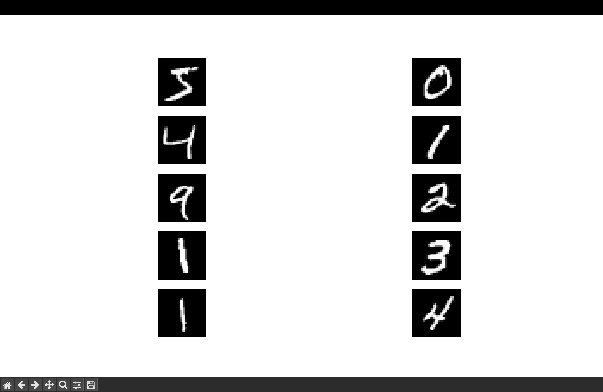
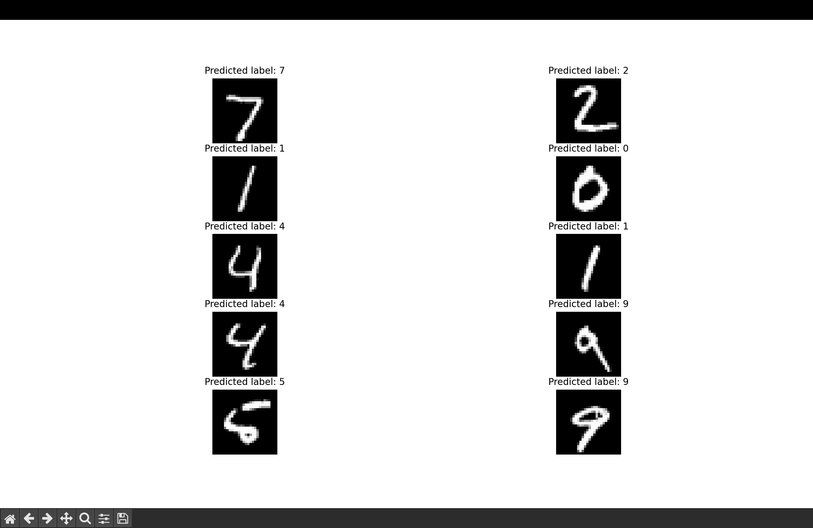

# Project 3 — Neural Networks with Keras (MNIST)

## Overview
This project explores **neural networks using Keras (TensorFlow)** through a handwritten digit classification task.
The objective is to understand the complete deep learning workflow, including data loading, visualization, model training, and prediction.

## Dataset
- **Source:** MNIST Handwritten Digits Dataset (loaded via Keras)
- **Training samples:** 60,000
- **Test samples:** 10,000
- **Image size:** 28 × 28 grayscale


## Methods
Data Preparation
Images are normalized for stable training

Sample digits are visualized to confirm correct dataset loading

Neural Network Model
Input layer: flattened 28 × 28 images

Fully connected (Dense) hidden layers

Output layer with softmax activation for multi-class digit classification (0–9)

## Training & Evaluation
Optimizer: Adam

Loss function: Sparse Categorical Crossentropy

Metric: Accuracy

Model performance is evaluated on the MNIST test dataset

## 📊 Results
Sample MNIST Digits

The figure below shows example handwritten digits from the MNIST dataset.
Visualizing these samples helps verify the dataset and provides intuition for the classification task.




### Model Predictions

After training, the neural network predicts labels for unseen test images.
The figure below shows several test samples along with their predicted digit labels, demonstrating the model’s classification performance.



### Summary
The neural network successfully learns to classify handwritten digits using the MNIST dataset.
This project demonstrates how basic feedforward neural networks can achieve strong performance on image classification tasks.

## How to Run / Reproduce Results

### Requirements
Python 3.8 or higher

Libraries: numpy, matplotlib, tensorflow

### Setup

1. Clone the repository and enter Project 3:
```bash
git clone https://github.com/maazkhanzz/Machine-Learning.git
cd Machine-Learning/Project\ 3


