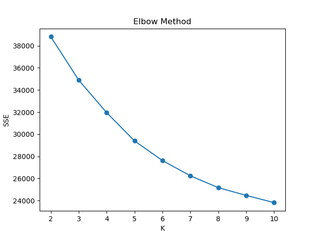
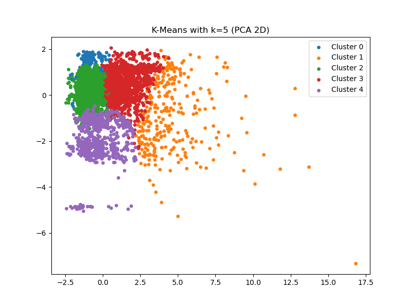
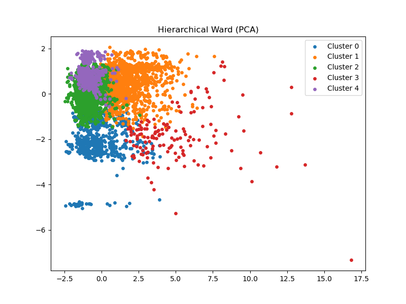
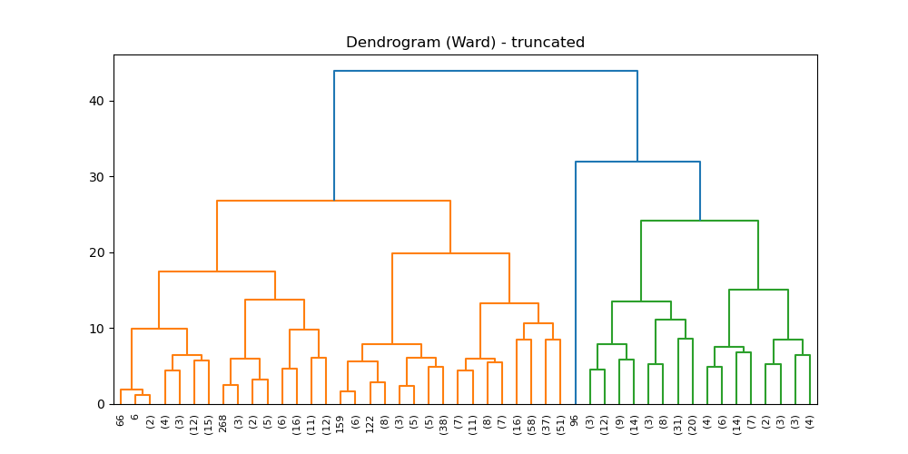
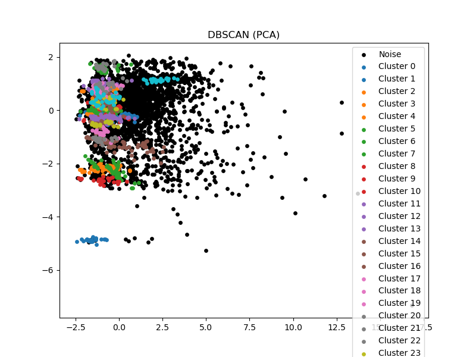

# Project 4 — Apartment Rental Clustering 

## Overview
This project explores **unsupervised clustering** on rental apartment listings to discover natural groups such as budget rentals, mid-range units, and luxury properties.
I compare three clustering approaches:
- **K-Means**
- **Hierarchical Agglomerative Clustering (Ward linkage)**
- **DBSCAN** (to detect outliers/noise)

## Dataset
- **Source:** UCI Machine Learning Repository — *Apartment for Rent Classified Dataset*
- **Subset used:** `apt_10k.csv` (10,000 listings)
- The raw dataset is **semicolon-separated** and uses `"null"` for missing values. I convert `"null"` to `NaN` and remove incomplete rows before clustering.

### Features used
**Numeric**
- `price`, `square_feet`, `bathrooms`, `bedrooms`, `latitude`, `longitude`

**Categorical**
- `category`, `currency`, `fee`, `has_photo`, `pets_allowed`, `price_type`, `cityname`, `state`, `source`

## Methods
### Preprocessing
- Numeric features are standardized using **StandardScaler**
- Categorical features are one-hot encoded using **OneHotEncoder(handle_unknown="ignore")**
- A **ColumnTransformer** applies both transformations consistently

### Models compared
- **K-Means:** tested `K = 2..10` using SSE (inertia) + silhouette score
- **Hierarchical:** Ward linkage with `n_clusters = 5`
- **DBSCAN:** tuned with `eps = 1.3`, `min_samples = 20`

## 📊 Cluster Evaluation Metrics 

1. Elbow Method (K-Means)

The elbow plot illustrates how the Sum of Squared Errors (SSE) decreases as the number of clusters increases.
Although no sharp elbow is present, the curve begins to flatten around K = 5, indicating diminishing improvements beyond this point.




2. Silhouette Scores

Silhouette scores measure how well-separated the clusters are.
While the highest score occurs at K = 2, selecting K = 5 provides a better balance between cluster separation and interpretability.


3. 📌 K-Means Results
K-Means with K = 5 (PCA Projection)

This PCA visualization shows the K-Means clustering result in two dimensions.
Clusters appear compact and reasonably well-separated, representing different rental market segments.




4. 🌳 Hierarchical Clustering (Ward Linkage, PCA Projection)

Hierarchical clustering using Ward linkage produces cluster groupings similar to K-Means, though slightly less balanced.
The PCA projection confirms consistent structure across methods.




5. Truncated Dendrogram (Ward Linkage)

The truncated dendrogram highlights large merges near the top of the hierarchy, suggesting approximately 4–6 meaningful clusters, which supports choosing five clusters.



6. 🔍 DBSCAN (PCA Projection) Results

DBSCAN identifies dense clusters and explicitly labels outliers as noise.
Noise points largely correspond to extremely expensive, large, or geographically isolated listings.




## Summary
K-Means with **K = 5** produced the most interpretable structure for this dataset.  
Hierarchical clustering supported similar groupings, while DBSCAN was useful for highlighting outliers and rare listings.

---

## How to Run / Reproduce Results

### Requirements
- Python 3.8 or higher
- Libraries: `numpy`, `pandas`, `scikit-learn`, `matplotlib`, `seaborn`

### Dataset

Download the dataset from UCI:
https://archive.ics.uci.edu/dataset/555/apartment+for+rent+classified

Use the 10,000-row subset named apt_10k.csv

Place apt_10k.csv inside the Project 4 directory

### Setup

1. Clone the repository and enter Project 4:
```bash
git clone https://github.com/maazkhanzz/Machine-Learning.git
cd Machine-Learning/Project\ 4


